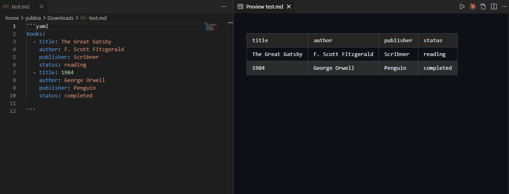

# Markdown YAML Preview

A VS Code extension that renders YAML as tables in Markdown Preview.



## Features

- **YAML code blocks**: Renders ` ```yaml ` or ` ```yml ` fenced blocks as tables
- **Frontmatter**: Renders YAML frontmatter (wrapped in `---`) as tables
- **Theme support**: Automatically adapts to VS Code's light/dark theme

## Display Formats

### Array Data (Horizontal Table)

```yaml
books:
  - title: The Great Gatsby
    author: F. Scott Fitzgerald
    publisher: Scribner
    status: reading
  - title: 1984
    author: George Orwell
    publisher: Penguin
    status: completed
```

↓

| title | author | publisher | status |
|-------|--------|-----------|--------|
| The Great Gatsby | F. Scott Fitzgerald | Scribner | reading |
| 1984 | George Orwell | Penguin | completed |

### Simple Data (Key-Value Table)

```yaml
title: My Document
author: John Doe
config:
  theme: dark
  version: 1.0
```

↓

| Key | Value |
|-----|-------|
| title | My Document |
| author | John Doe |
| config.theme | dark |
| config.version | 1.0 |

## Development

```bash
# Install dependencies
npm install

# Build
npm run build

# Watch mode
npm run watch
npm run watch:preview
```

## Testing

1. Open this folder in VS Code
2. `Ctrl+Shift+P` → `Debug: Start Debugging`
3. Open a `.md` file in the new window
4. `Ctrl+Shift+V` to open Markdown Preview

## License

MIT
